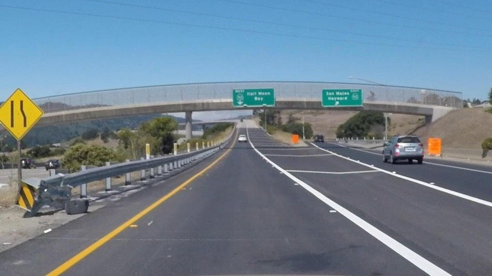
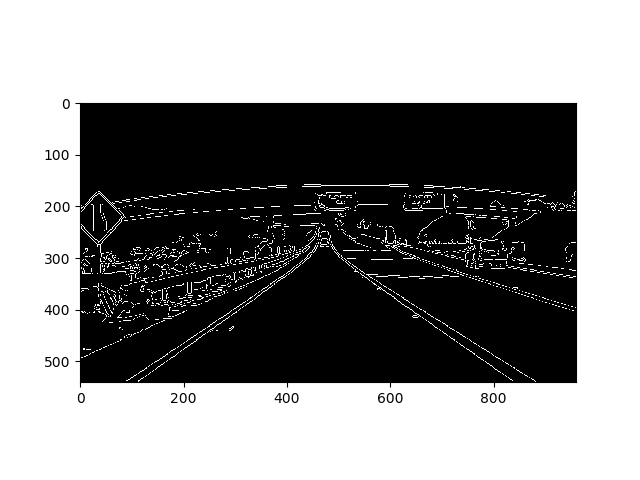
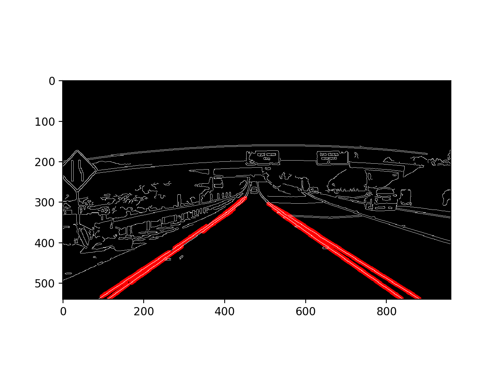

# **Finding Lane Lines on the Road** 


Overview
---

When we drive, we use our eyes to decide where to go.  The lines on the road that show us where the lanes are act as our constant reference for where to steer the vehicle.  Naturally, one of the first things we would like to do in developing a self-driving car is to automatically detect lane lines using an algorithm.

In this project,lane lines can be detected in images or videos using Python and OpenCV.  OpenCV means "Open-Source Computer Vision", which is a package that has many useful tools for analyzing images.


 # The Lane Finding Pipeline

 The Pipeline consist of 5 steps.The first step is to convert the image to grayscale and applyied Gaussian smoothing to clean up any noise.
 

###### Convert to Grayscale
```python
import cv2  #bringing in OpenCV libraries
gray = cv2.cvtColor(image, cv2.COLOR_RGB2GRAY) #grayscale conversion
plt.imshow(gray, cmap='gray')

```
###### Apply a 5x5 Gaussian Smoothing
```python
kernel_size = 5
blur_gray = cv2.GaussianBlur(gray,(kernel_size, kernel_size), 0)
```
The kernel_size for Gaussian smoothing to be any odd number.
A larger kernel_size implies averaging, or smoothing, over a larger area.


The second step is to use OpenCV Canny Edge detector.
By applying Canny to the gray image we get the edges.


###### Apply Canny to get the edges images
```python
edges = cv2.Canny(gray, low_threshold, high_threshold)
```
The Canny algorithm  will first detect strong edges pixel above
 the high threshold and reject pixels below the low threshold.
 Furthermore, pixels with values between the low_threshold and high_threshold
  are included as long as they are connected to strong edges. The output
 edges is a binary image with white pixels tracing out the detected edges and black everywhere else.



Then we apply a polygon mask to remove the unwatend areas in the image. Areas that are unlikely to contain the lane lines.
###### Four Side Polygon on Canny Edge image
```python
    mask_edges = np.zeros_like(canny_edges)
    image_shape = image_file.shape
    vertices = np.array([[(0,image_shape[0]),(440, 320), (image_shape[1]-440, 320), (image_shape[1],image_shape[0])]], dtype=np.int32)
    cv2.fillPoly(mask_edges, vertices,255)
    masked_edges = cv2.bitwise_and(canny_edges, mask_edges)
```

At last we use Hough transform to identify the lane lines.In Hough space, I can represent my "x vs. y" line as a point in "m vs. b" instead.
The Hough Transform is just the conversion from image space to Hough space. So, the characterization of a line in image space will be a single point at the position (m, b) in Hough space.

######
```python
# Define the Hough transform parameters
# Make a blank the same size as our image to draw on
rho = 1
theta = np.pi/180
threshold = 1
min_line_length = 40
max_line_gap = 20
line_image = np.copy(image)*0 #creating a blank to draw lines on

# Run Hough on edge detected image
lines = cv2.HoughLinesP(masked_edges, rho, theta, threshold, np.array([]),
                            min_line_length, max_line_gap)

# Iterate over the output "lines" and draw lines on the blank
for line in lines:
    for x1,y1,x2,y2 in line:
        cv2.line(line_image,(x1,y1),(x2,y2),(255,0,0),10)

# Create a "color" binary image to combine with line image
color_edges = np.dstack((masked_edges, masked_edges, masked_edges))

# Draw the lines on the edge image
combo = cv2.addWeighted(color_edges, 0.8, line_image, 1, 0)
plt.imshow(combo)
```


# Potential shortcomings with the pipeline

The pipeline will fail if

1. The car makes a sharp turn, there may not be a lot of marking lanes for identification
2. Sunny sun light on the road may create high contrast on the road therefore causing low lane markings.
3. Pot hole on the road may seem like lane mark therefore the identification of lane might be incorrect

# Possible Improvement to the Pipeline


# Prerequisite
1. Install the [CarND Term1 Starter Kit](https://github.com/udacity/CarND-Term1-Starter-Kit/blob/master/README.md)
2. Set up the [CarND Term1 Starter Kit](https://classroom.udacity.com/nanodegrees/nd013/parts/fbf77062-5703-404e-b60c-95b78b2f3f9e/modules/83ec35ee-1e02-48a5-bdb7-d244bd47c2dc/lessons/8c82408b-a217-4d09-b81d-1bda4c6380ef/concepts/4f1870e0-3849-43e4-b670-12e6f2d4b7a7)
3. Open the code in a Jupyter Notebook.Jupyter is an Ipython notebook where we can run blocks of code and see results interactively.  All the code for this project is contained in  the Jupyter notebook.
To start Jupyter in your browser, use terminal to navigate to the project directory and then run the following command at the terminal prompt (be sure Python 3 carnd-term1 environment is activated)

`> jupyter notebook`

