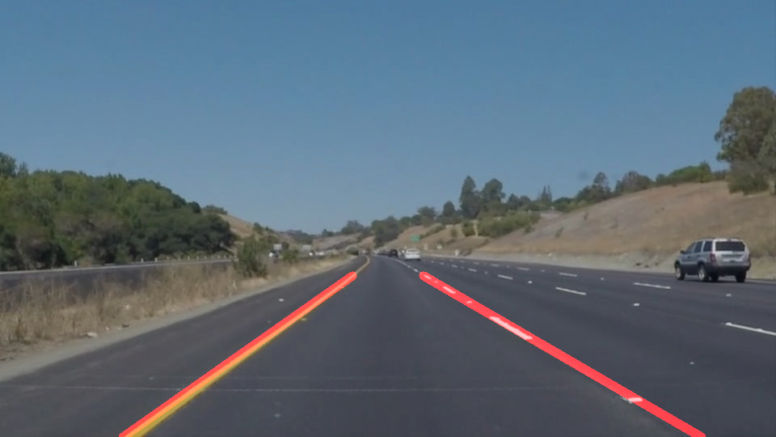

[//]: # (Image References)
[image_0]: ./misc/LaneLinesPass.gif
# Finding Lane Lines on the Road
![alt text][image_0] 

# Overview

When we drive, we use our eyes to decide where to go. The lines on the road that show us where the lanes are, act as our constant reference for where to steer the vehicle. Naturally, one of the first things we would like to do in developing a self-driving car is to automatically detect lane lines using an algorithm.

In this [Udacity clone project](https://github.com/udacity/CarND-LaneLines-P1), lane lines can be detected in images or videos using `Python` and `OpenCV`.  `OpenCV` means "Open-Source Computer Vision," which is a package that has many useful tools for analyzing images.

 # The Lane Finding Pipeline
 
 
The Pipeline consist of 5 steps. The first step is to convert the image to grayscale and the second step is to apply Gaussian smoothing to clean up any noise.

###### Convert to Grayscale
```python
import cv2  #bringing in OpenCV libraries
gray = cv2.cvtColor(image, cv2.COLOR_RGB2GRAY) #grayscale conversion
plt.imshow(gray, cmap='gray')
```
###### Apply a 5x5 Gaussian Smoothing
```python
kernel_size = 5
blur_gray = cv2.GaussianBlur(gray,(kernel_size, kernel_size), 0)
```
The `kernel size` for `Gaussian smoothing` can be any odd number but for this project the kernel size is 5.
A larger kernel size implies averaging, or smoothing, over a larger area.


The third step is to apply OpenCV `Canny Edge Detector`. By applying it to the gray image we get the edges from the image.
The `Canny` algorithm  will first detect strong edges pixel above the `high threshold` and reject pixels below the `low threshold`.
Moreover, pixels with values between the `low_threshold` and `high_threshold` are included as long as they are connected to strong edges. The output edges is a binary image with white pixels tracing out the detected edges and black everywhere else.

###### Apply Canny to get the edges images
```python
edges = cv2.Canny(gray, low_threshold, high_threshold)
```


The fourth is to apply a polygon mask to remove unwanted areas in the image, such as, areas that are unlikely to contain the lane lines.

###### Four Side Polygon on Canny Edge image
```python
    mask_edges = np.zeros_like(canny_edges)
    image_shape = image_file.shape
    vertices = np.array([[(0,image_shape[0]),(440, 320), (image_shape[1]-440, 320), (image_shape[1],image_shape[0])]], dtype=np.int32)
    cv2.fillPoly(mask_edges, vertices,255)
    masked_edges = cv2.bitwise_and(canny_edges, mask_edges)
```

The fifth step is to apply `Hough Transform` to identify the lane lines. In `Hough space`, we can represent our "x vs. y" line as a point in "m vs. b".


The `Hough Transform` is just the conversion from image space to Hough space. So, the characterization of a line in image space will be a single point at the position (m, b) in Hough space.

######
```python
# Define the Hough transform parameters
# Make a blank the same size as our image to draw on
rho = 1
theta = np.pi/180
threshold = 1
min_line_length = 40
max_line_gap = 20
line_image = np.copy(image)*0 #creating a blank to draw lines on

# Run Hough on edge detected image
lines = cv2.HoughLinesP(masked_edges, rho, theta, threshold, np.array([]),
                            min_line_length, max_line_gap)

# Iterate over the output "lines" and draw lines on the blank
for line in lines:
    for x1,y1,x2,y2 in line:
        cv2.line(line_image,(x1,y1),(x2,y2),(255,0,0),10)

# Create a "color" binary image to combine with line image
color_edges = np.dstack((masked_edges, masked_edges, masked_edges))

# Draw the lines on the edge image
combo = cv2.addWeighted(color_edges, 0.8, line_image, 1, 0)
plt.imshow(combo)
```


# The draw_lines method

After getting the Hough Transform, the draw_lines method has been updated and used to average the line segments detected to map out the full extent of
both right and left lanes on the road. By Calculating the average b and m weighted using the left and right hypotenuse, we can draw the 
new and right lines with color and thickness on the road.



######
def draw_lines()


# Potential shortcomings with the pipeline

The pipeline will not work:

1. If the vehicle makes a sharp turn, it will not detect the lane lines.
2. If there's a lot of potholes on the road. Potholes may seem like lane lines which may confuse the pipeline.
3. If more than 2 lines are identified on the road.


# Possible Improvement to the Pipeline

1. Train a deep neural network to identify what lane lines looks like.
2. The model will be suitable for sharp turn or quick change in lanes and it will be tuned to exclude potholes.
3. Add more then 1 camera

# Prerequisite
1. Install the [CarND Term1 Starter Kit](https://github.com/udacity/CarND-Term1-Starter-Kit/blob/master/README.md)
2. Open the code in a Jupyter Notebook.Jupyter is an Ipython notebook where we can run blocks of code and see results interactively.  All the code for this project is contained in  the Jupyter notebook.
To start Jupyter in your browser, use terminal to navigate to the project directory and then run the following command at the terminal prompt (be sure Python 3 carnd-term1 environment is activated)
* `> jupyter notebook`

